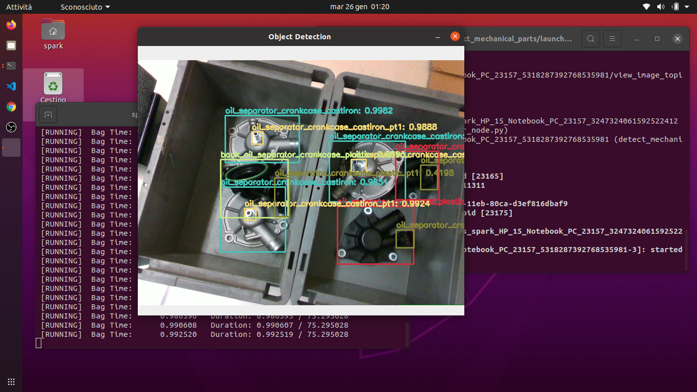

# Grasping with object skeleton

ROS package to read an image from topic, detect mechanical parts of cars using YOLOv4 and generate object skeleton.

This code is provided without any warranty about its usability. It is for educational purposes and should be regarded as such.
___
## Launch Requirements
* ROS Melodic (*Recommended for Ubuntu 18.04*)
* Python 3.6+
* OpenCV 4.7.0+
* NumPy 1.19.5+
* Download [yolo-obj.weights](https://drive.google.com/file/d/1rSoWctsJGUFySvskffHQ4HlEMEv7jYyw/view?usp=sharing) and place it in the [yolo_model](yolo_model) folder

## Installation
In order to install graspingWithSkeleton, clone this repository in your catkin workspace and compile the package using ROS.

```shell
$ cd catkin_workspace/src
$ git clone https://github.com/leonard0guerra/graspingWithSkeleton.git
$ cd ..
$ catkin build graspingWithSkeleton
```

## Detection :robot:

1. To launch graspingWithSkeleton run the command:
    ```shell
    $ roslaunch skeleton skeleton.launch
    ```
2. You can download [this bag](https://drive.google.com/drive/folders/1ZWlWnwk1iz21gFU0mAgiG371qSp5lNLL?usp=share_link) and run the command:
    ```shell
    $ rosbag play <bag-name>.bag
    ```
You can change the parameters in the [launch file](launch/skeleton.launch) (e.g. topics, confidence threshold value...) and launch it.
